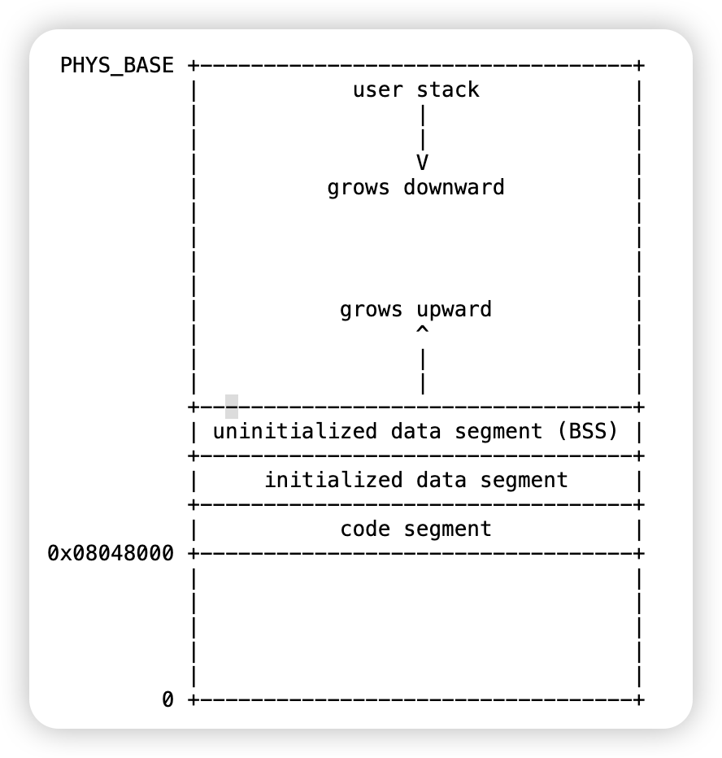

## Required Background

### Program Start

유저 프로그램을 실행하는 entrypoint는 다음과 같다.

```c
void
_start (int argc, char *argv[]) 
{
  exit (main (argc, argv));
}
```

pintos 내부 [load](../src/userprog/process.c#L276) 모듈에는 argc, argv 파싱 및 stack으로 passing하는 모듈이 구현되어 있지 않다보니, 이를 우선 과제로 진행하게 된다.

### function call

함수 호출시에는 아키텍처에 따라 인자를 넘기는 방식이 다름

핀토스는 `80x86` 기반으로 다음과 같은 `calling convension`을 따른다.

1. call function
2. push return addr(next instruction addr) to stack
3. push argc(argument count) to stack
4. push args to stack
5. jump to function code addr
6. add esp to calling function stack frame(local variables)
7. process calling function instructions
8. if return value exist, store it into eax
9. sub esp function stack frame
10. pop return address
11. jump to return address


### proccess memory layout

프로세스는 각자 격리된 메모리 공간을 가진다. 이때, 해당 virtual memory layout은 다음과 같다 (32-bit address system)



유저 프로그램 실행 시,

1. 커널 쓰레드 running
2. 유저 프로세스 생성
3. 생성된 프로스세 memory 영역 할당
4. code, data segment copy
5. stack segment load
6. eip를 entrypoint(code segment)로 설정

해당 모듈은 [load()](../src/userprog/process.c#L276)에 구현되어 있음

### loading

elf 바이너리 파일로부터 실행에 필요한 헤더, 코드, 전역변수들을 memory segement에 로드한다.


이때, 추가적으로 고정된 stack memory를 할당한다. (VM에서 확장 구현)

### system call

유저 프로세스가 프로세스 생성, 메모리 할당과 같은 커널에서 수행해야하는 작업이 필요할 때, 실행

**1. pass argument to stack and trap**

```c
#define syscall0(NUMBER)                                                       \
  ({                                                                           \
    int retval;                                                                \
    asm volatile("pushl %[number]; int $0x30; addl $4, %%esp"                  \
                 : "=a"(retval)                                                \
                 : [number] "i"(NUMBER)                                        \
                 : "memory");                                                  \
    retval;                                                                    \
  })

/* Invokes syscall NUMBER, passing argument ARG0, and returns the
   return value as an `int'. */
#define syscall1(NUMBER, ARG0)                                                 \
  ({                                                                           \
    int retval;                                                                \
    asm volatile("pushl %[arg0]; pushl %[number]; int $0x30; addl $8, %%esp"   \
                 : "=a"(retval)                                                \
                 : [number] "i"(NUMBER), [arg0] "g"(ARG0)                      \
                 : "memory");                                                  \
    retval;                                                                    \
  })
```
[syscall macro](../src/lib/user/syscall.c)

system call 구현체를 확인하면 argument의 개수에 따라 다른 매크로로 되어있다.

system call number와 argument의 값 또는 주소를 stack에 담아서 `interrupt 0x30` 을 호출한다.

[interrupt register](../src/userprog/syscall.c#L94)

kernel 부팅시에 interrupt table에 system call interrupt handler를 등록하여 해당 interrupt 발생 시, system call 처리를 할 수 있게 한다.

**2. process system call**

이후 요청한 system call number에 따라서 해당 작업을 처리한 뒤, interrupt frame 내 eax register에 return value를 담는다.

**3. return to user mode**

handler가 종료되면 다시 user mode로 전환되어 어셈블리 코드 실행 context로 돌아오게 된다.

여기서 eax를 확인하여 시스템 콜 함수의 return으로 전달

### interrupt

CPU는 명령을 실행하는 동안, 인터럽트(Interrupt)를 통해 실행 컨텍스트를 변경하거나 예외 작업을 처리하게 된다

인터럽트는 시스템의 실행 흐름을 제어하며, 하드웨어나 소프트웨어적 이벤트에 의해 발생할 수 있다

**external Interrupts**
외부 IO device (network, keyword, timer) 등에 의해 발생되는 interrupt로, CPU 로 IO 버스를 통해 전달된다


**Internal Interrupt**
코드 실행 중에 발생하는 인터럽트로, 예외(Exceptions)라고도 불린다.

[exception.c](../src/userprog/exception.c#L41)

주요 예외 처리 대상:

* Overflow
* Zero Divide
* Page Fault
* System Call

이러한 예외는 실행 중에 발생할 수 있으며, 각 예외에 대해 적절한 핸들러가 매핑된다.
만약 예외가 정상적이지 않거나 예상되지 않은 경우, 프로그램을 종료하거나 하드웨어 수준에서 특정 작업을 중단하는 방식으로 처리될 수 있음

ex) Segmentation Fault가 발생하면 사용자 프로그램 종료

### Kernel vs User mode 

### process 

### Lock & blocking

## 구현

### Arguemnt Passing

ELF 바이너리 파일을 Pintos에서 로드한 뒤, 유저 모드에서 실행할 수 있도록 기능을 구현한다.

이때, command line에는 실행할 파일과 arguments들을 넘겨주는데, 이때, file_name과 arguments들을 분리하여 load시에 stack에 넘겨준다.


### Memory Access Validation

user mode로 실행되고 있는 process는 virtual address로 여러 process가 모든 memory 영역을 사용하는 것처럼 virtualize를 진행한다.

프로세스가 virtual address상 kernel 영역에 접근을 막고, physical address로 mapping이 되지 않은 invalid한 access에 대한 접근을 막도록 구현한다. 

구현은 'threads/vaddr.h' , 'userprog/pagedir.h'을 참고한다.

### System Call
user mode에서 실행하는 system call은 stack에 arguments들을 쌓고 interrupt을 발생시킨다.

현재 process의 context를 intr_frame에 담아 kernel모드로 전환 후, syscall_handler를 호출한다. 기존 스켈레톤 코드에는 전 과정까지가 구현되어 있고 우리는 이후의 과정만 구현을 완료하면 된다.

syscall_handler 내부에서 stack의 esp로부터 argument들을 확인 후 system call number에 해당하는 구현을 완료후 return 값을 eax에 담아 user mode로 전환한다.